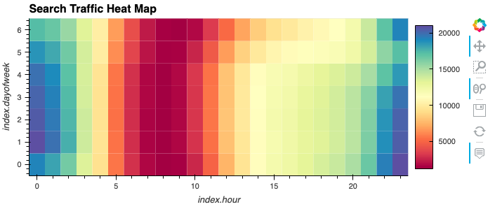
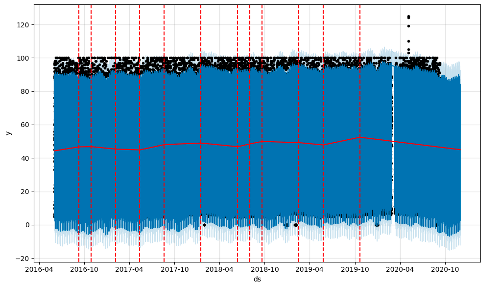

# *Columbia Fintech Challenge 11*
## *Google Colab and Time Series Analysis with FB Prophet*

With over 200 million users, MercadoLibre is the most popular e-commerce site in Latin America. The task is to analyze the company's financial and user data in clever ways to make the company grow. So, we wanted to find out if the ability to predict search traffic can translate into the ability to successfully trade the stock.

Product:

Jupyter notebook that contains our data preparation, analysis, and visualizations for all the time series data that the company needs to understand. We use text and comments to document your findings, and we answer the question prompts in the instructions. Specifically, this file contains the following:

 - Visual depictions of seasonality (as measured by Google Search traffic) that are of interest to the company.

 - An evaluation of how the company’s stock price correlates to its Google Search traffic.

 - A Prophet forecast model that can predict hourly user search traffic.

 - Answers to questions in the instructions that you write in your Jupyter Notebook.








---

## Technologies ##

### **Hardware Used**

MacBook Air (13-inch, 2017)

    Processor 1.8 GHz Dual-Core Intel Core i5
    macOS Monterey version 12.6.3


### **Dependencies**

This project used python 3.11 with the following packages:

* [sys](https://docs.python.org/3/library/sys.html?highlight=sys#module-sys) 
  
* [csv](https://docs.python.org/3/library/csv.html?highlight=csv#module-csv) 

* [PyStan](https://pystan.readthedocs.io/en/latest/#:~:text=PyStan%20is%20a%20Python%20interface,and%20high%2Dperformance%20statistical%20computation.) 

* [Prophet](https://pypi.org/project/fbprophet/#:~:text=Prophet%20is%20a%20procedure%20for,several%20seasons%20of%20historical%20data.)

* [hvplot](https://hvplot.holoviz.org/getting_started/hvplot.html)

* [HoloViews](https://holoviews.org/)

* [NumPy](https://numpy.org/doc/stable/user/absolute_beginners.html)

* [pandas](https://pandas.pydata.org/docs/)

* [datetime](https://docs.python.org/3/library/datetime.html#:~:text=The%20datetime%20module%20supplies%20classes,General%20calendar%20related%20functions.)

* [matplotlib.pyplot](https://matplotlib.org/3.5.3/api/_as_gen/matplotlib.pyplot.html)

* [Path](https://pandas.pydata.org/docs/reference/api/pandas.concat.html)

---
## *Pre-Installation Guide*

Before running the application first install the following dependencies.

```python
> conda create -n <name_env> python=3.8 anaconda
> conda activate <name_env>

	> pip install --upgrade pip
	> conda update conda
	> conda install numpy cython -c conda-forge
	> conda install matplotlib scipy pandas -c conda-forge
	> conda install pystan -c conda-forge
	> conda install -c anaconda ephem
	> pip install scikit-learn
	> conda install -c conda-forge prophet
	> conda install -c conda-forge jupyterlab=3
	> conda update jupyterlab
	> pip install fire
	> pip install questionary
	> pip install python-dotenv
	> conda install -c pyviz hvplot
	> conda install -c pyviz hvplot geoviews
	> conda update SQLAlchemy
	> conda install -c conda-forge voila
	> pip install pandas_datareader
	> python -m pip install ipykernel

```
---

The installed application is run through Google Colab web-based interactive development environment (IDE) interface:

[GoogleColab](https://colab.research.google.com/)


---
## *Installation of application (i.e. github clone)*

 In the terminal, navigate to directory where you want to install this application from the repository and enter the following command

```python
git clone git@github.com:tmagee28/Columbia_Fintech_Challenge_11_Forecasting_Net_Prophets.git
```

---


## **Contributors**

### **Author**

Tommy Magee
[LinkedIn](https://www.linkedin.com/in/thomas-magee-2009a72a/)


### **BootCamp lead instructor**

Vinicio De Sola

### **BootCamp teaching assistants**

Eli Holden

---

## License

MIT License

Copyright (c) [2022] [Thomas 'Tommy' Magee]

Permission is hereby granted, free of charge, to any person obtaining a copy
of this software and associated documentation files (the "Software"), to deal
in the Software without restriction, including without limitation the rights
to use, copy, modify, merge, publish, distribute, sublicense, and/or sell
copies of the Software, and to permit persons to whom the Software is
furnished to do so, subject to the following conditions:

The above copyright notice and this permission notice shall be included in all
copies or substantial portions of the Software.

THE SOFTWARE IS PROVIDED "AS IS", WITHOUT WARRANTY OF ANY KIND, EXPRESS OR
IMPLIED, INCLUDING BUT NOT LIMITED TO THE WARRANTIES OF MERCHANTABILITY,
FITNESS FOR A PARTICULAR PURPOSE AND NONINFRINGEMENT. IN NO EVENT SHALL THE
AUTHORS OR COPYRIGHT HOLDERS BE LIABLE FOR ANY CLAIM, DAMAGES OR OTHER
LIABILITY, WHETHER IN AN ACTION OF CONTRACT, TORT OR OTHERWISE, ARISING FROM,
OUT OF OR IN CONNECTION WITH THE SOFTWARE OR THE USE OR OTHER DEALINGS IN THE
SOFTWARE.

